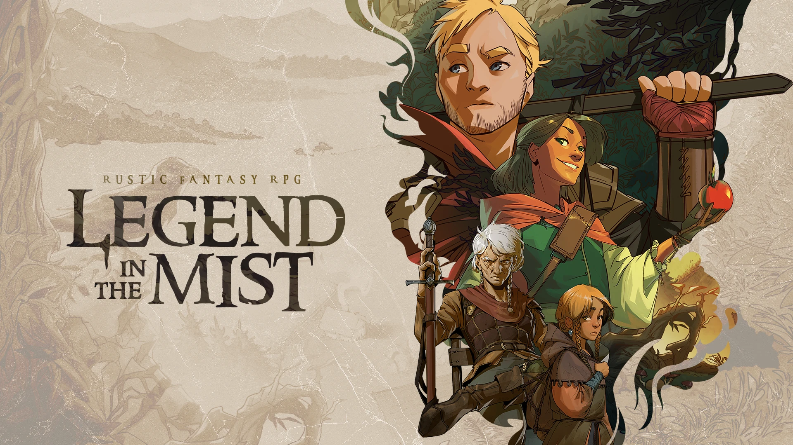

<h1 align="center">⚜️<a href="https://www.kickstarter.com/projects/sonofoak/legend-in-the-mist-rpg" rel="noreferrer" target="_blank">Legend in the Mist Demo</a>⚜</h1>

<strong><em>For Foundry Virtual Tabletop</em></strong>

 

> A rustic fantasy tabletop RPG based on the acclaimed City of Mist. Spin a tale of journey and peril where choices transform gameplay.

## Welcome to Legend in the Mist

This is a system for playing the game **Legend in the Mist** in Foundry Virtual Tabletop.

The game is currently in development and is being funded through a [Kickstarter campaign](https://www.kickstarter.com/projects/sonofoak/legend-in-the-mist-rpg).

## Installation

> [!WARNING]
> This system is still under early development and may have some rough edges. The game itself is also under development and may see major changes. Consider this an early taster of what is coming.

Thank you for wanting to try out this system! The game is still under development and things may change or break. There are also features missing that will be added as development progresses.

**To install the system in Foundry Virtual Tabletop:**

1. Find the system called "Legend in the Mist" in the systems list in the setup menu.

2. Create a new world using the "Legend in the Mist" system.

\*_This system is published with express permission from **Son of Oak**_
